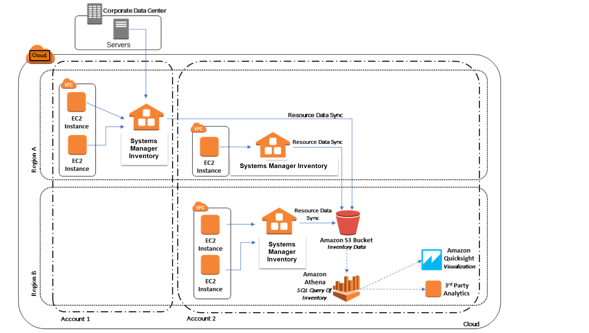
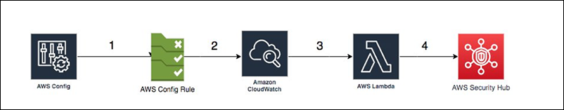
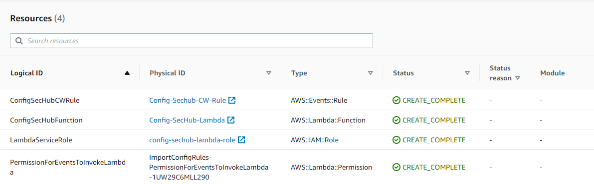
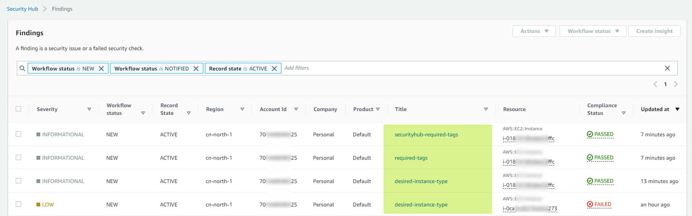

# Use AWS Config and Systems Manager to audit installed software on EC2 instances

### AWS services: AWS Config, Systems Manager, Security Hub

## Workflow Overview
### Step 1: Use Systems Manager Inventory to gather installed applications on EC2 instances

### Step 2: Create Config rules to audit the installed applications
### Step 3: Consolidate Config evaluation result of multiple accounts
#### Option 1: Import evaluation result into Security Hub findings

#### Option 2: Develop a script (Lambda) to read evaluation result and generate a file for BI tool

## Solution deployment
### Step 1: Systems Manager (SSM) Inventory
1. Make sure SSM Agent is installed on EC2 instances and up-to-date;
2. (AWS Console) Setup Inventory;
3. Create resource data sync.

*Doc reference:
https://docs.amazonaws.cn/en_us/systems-manager/latest/userguide/sysman-inventory-configuring.html*

### Step 2: Config rules
Create AWS managed config rule - ec2-managedinstance-applications-required. Specify the application name and version (optional).

*Doc reference:
https://docs.aws.amazon.com/config/latest/developerguide/ec2-managedinstance-applications-required.html*

### Step 3: Consolidate evaluation result
#### Option 1: Security hub findings
1. Deploy the Cloud formation template (in progress);

*A CloudWatch Event rule and Lambda function will be created:*


- The AWS Config rule sends compliance change items to AWS CloudWatch;
- When AWS CloudWatch receives the compliance change, a CloudWatch event rule triggers the AWS Lambda function;
- The Lambda function parses the event received from CloudWatch and imports it into Security Hub as a finding.

2. Verify the evaluation results appear in Security Hub findings;


3. Integrate Security Hub with Organizations to aggregate the findings into a single place (Security Hub delegated administrator account).

*Doc reference: https://aws.amazon.com/cn/blogs/security/how-to-import-aws-config-rules-evaluations-findings-security-hub/
https://www.amazonaws.cn/en/new/2021/amazon-security-hub-organizations-security-china-regions/*

#### Option 2: Custom script

Develop a custom script (PowerShell/Python etc.) to read evaluation result into a csv file in S3 bucket, then use BI tool to display.

For example:

```
# List the non-compliant resources:
Get-CFGComplianceDetailsByConfigRule -ConfigRuleName required-tags -ComplianceType NON_COMPLIANT | ForEach-Object {$_.EvaluationResultIdentifier.EvaluationResultQualifier}
 
ConfigRuleName ResourceId                                 ResourceType
-------------- ----------                                 ------------
required-tags  i-00aa1a1441d7c9450                        AWS::EC2::Instance
required-tags  i-018747dfc8de32ffc                        AWS::EC2::Instance
required-tags  i-01918bad8bbe37ed9                        AWS::EC2::Instance
required-tags  i-051aefb11dbbc0ff0                        AWS::EC2::Instance
required-tags  i-064055239984c9db3                        AWS::EC2::Instance
required-tags  i-06c35be5e3c59fc7f                        AWS::EC2::Instance
required-tags  i-0f703b68f01e1db59                        AWS::EC2::Instance
```

## Pricing (BJS region):
#### AWS Config:
*¥ 0.02 per configuration item*

*¥ 0.0067 per rule evaluation (First 100,000 rule evaluations)*

*https://www.amazonaws.cn/en/config/pricing/*

#### Systems Manager:

*Inventory has no additional charges*

*https://www.amazonaws.cn/en/systems-manager/pricing/*

#### Security Hub:

*¥0.0000042 per Finding ingestion event*

*https://www.amazonaws.cn/en/security-hub/pricing/*

#### S3, Lambda, CloudWatch Event rules...
